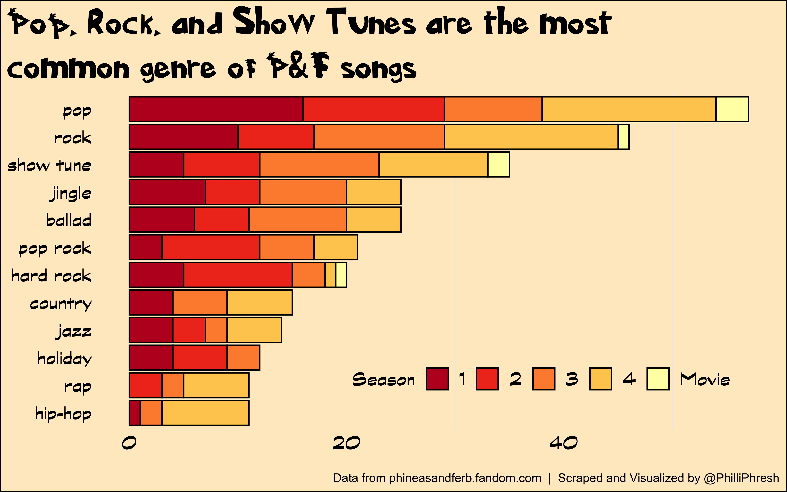

# Aren’t you a little old to be watching Phineas and Ferb?

Yes, yes I am. Phineas and Ferb was Disney a television series that
aired from 2007 to 2015, with the occasional one-off movies following
it’s wrap. I love Phineas and Ferb! From the jokes, to the songs, to the
inators, everything about it brings me joy. Going through a recent watch
on Disney+ inspired me to analyze Phineas and Ferb data, specifically,
focusing on the music in the show.

# Hey, where’s the data from?

While making the plots (see below) was the more exciting part, gathering
the data was definitely the more challenging and time-consuming part of
this project. After looking around various websites, I ended up deciding
to web scrape from the [Phineas and Ferb Fandom
page](https://phineasandferb.fandom.com/wiki/Phineas_and_Ferb_Wiki). To
pull IMDB ratings, I obviously also had to scrape data from
[IMDb](https://www.imdb.com/title/tt0852863/episodes?season=1).

Since Fandom is a Wiki site, the webpages scraped were not always in a
consistent format and some assumptions needed to be made. Additionally,
due to IMDb organization, an assumption about episode ratings needed to
be made. The assumptions are as follows:

1.  The first episode to be listed in a song’s narrative description is
    the episode it first aired in.
2.  All the data taken from the Fandom Wiki is correct. For the most
    part I think this is a safe assumption but genres could be
    misclassified, episodes could be mislabeled, etc.
3.  Each episode paired would score the same IMDb rating if voted on
    together. This is probably not true but IMDb only takes ratings for
    episodes paired in a 22-ish minute airing.

# Whatchyu doin’?

The rest of this report is organized by questions I thought were
interesting or plots I thought might be cool.

## What are the most common genres?

The following plot shows the top most common song genres in Phineas and
Ferb and their prevalence among different seasons. Even though this is
probably the most basic question to ask about the songs, I thought it
was interesting because even Dan Povenmire himself might not have an
idea of just how many pop and rock songs there are (or how few jazz
songs). I also don’t mean to imply that there needs to be an equal
distribution of genres, I believe the song should fit the context of the
episode around it. I am only showing the top 12 genres below in order to
keep the visualization clean and focused.

<!-- -->

I find it interesting that hip-hop and rap are pretty infrequent until
season 4 and not present in any movies. Season 4 probably has the most
uniform variety in musical genres. This genre prevalence plot is
especially interesting when compared to the plot below that compares
IMDb ratings.

## How long are the songs?

The next plot show the distribution of song lengths over each season.
The songs on the far left of the plot are most likely all jingles (e.g.,
Doofenshmirtz’s Quality Bratwurst).

<!-- -->

The first notable observation from the plot above is that movies the
movies tend to have longer songs—this makes sense given that movies will
have more time to burn. The next, more subtle observation is that the
median song length increases over time and the variability of song
length decreases over time. Essentially, the songwriters of the show
“found what works” and ended up writing songs around one minute more
often.

## IMDb Ratings

> [“In a world and business that is awash with data, it is tempting to
> use data to answer all of our questions, including creative questions.
> I urge all of you not to do
> that.”](https://wdwnt.com/2021/10/bob-iger-warns-disney-executives-to-avoid-letting-data-influence-creative-decisions/)
>
> -Bob Iger, former CEO of The Walt Disney Company

It is important to preface the following chart with my current view on
data-driven creative decisions. I believe stakeholders should not
discount or ignore the use of data in making decisions, even if creative
but that does not mean data should be the only consideration. There may
be times that an analysis of data suggests a different answer to a
question than someone’s creative intuition and when those times come it
is important to consider all facts and circumstances.

All that being said, the plot below examines IMDb ratings of Phineas and
Ferb episodes with songs of various genres.

<!-- -->

For the statistically-unprepared, the black bars on the plot above show
“confidence intervals” for the median IMDb rating on each genre: if the
horizontal line overlaps with another, there is not enough data to
suggest it is anything more than random chance that different genres
have different median IMDb ratings. The main takeaway here is that we
can be pretty confident that episodes with hip-hop or disco songs will
rate lower than episodes with rock or country songs. Of course, the show
would get dull fast if, in a misguided attempt to maximize ratings, all
songs were rock.

## Can my personal taste predict gold?

While there are hundreds of songs that I like in the series, there are
some that I love (and some that reference a gelatin monster). The plot
below shows episode rankings and highlights episodes with songs that I
could remember really enjoying just by reading the list of songs names.
In no particular order, those songs are:

-   When We Didn’t Get Along
-   City of Love
-   Let’s Take A Rocketship To Space
-   E.V.I.L. B.O.Y.S.
-   Busted
-   Flawless Girl
-   Disco Miniature Golfing Queen
-   S’Winter
-   Big Honkin’ Hole in My Heart
-   Ain’t Got Rhythm
-   You Snuck Your Way Right Into My Heart
-   Little Brothers
-   Chains on Me
-   Yodel Odel Obey Me
-   Izzy’s Got the Frizzies
-   There’s a Platypus Controlling Me
-   Dance Baby
-   Aerial Area Rug
-   Double Dutch Song
-   Waggle Dance
-   In the Empire
-   When Tomorrow is This Morning Again
-   O.W.C.A. Files
-   My Undead Mummy

<!-- -->

Looks like I might need to read [*Words with
Music*](https://books.google.com/books/about/Words_with_Music.html?id=hRb8H-kDXcoC)
again. Or on the contrary, perhaps my taste for lower ranking episodes
just proves my love for the show. I’ll go with both.

# The 104th day of Summer

While there is still a lot more I could explore with this Phineas and
Ferb data, I am stopping here for now. So “oh, there you are Perry” and
whatnot. To any other fans reading this, feel free to reach out with any
questions or comments you have on the analysis. I’d love to discuss!
